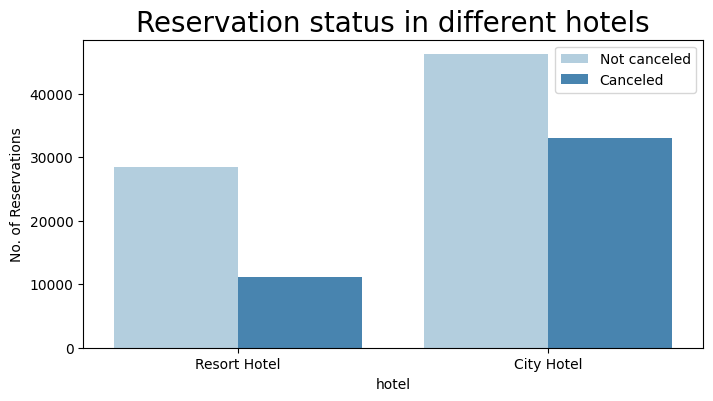
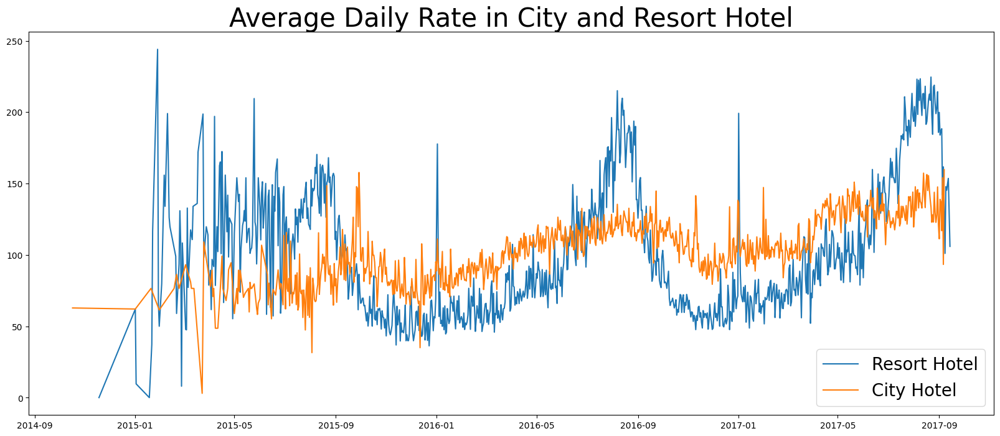
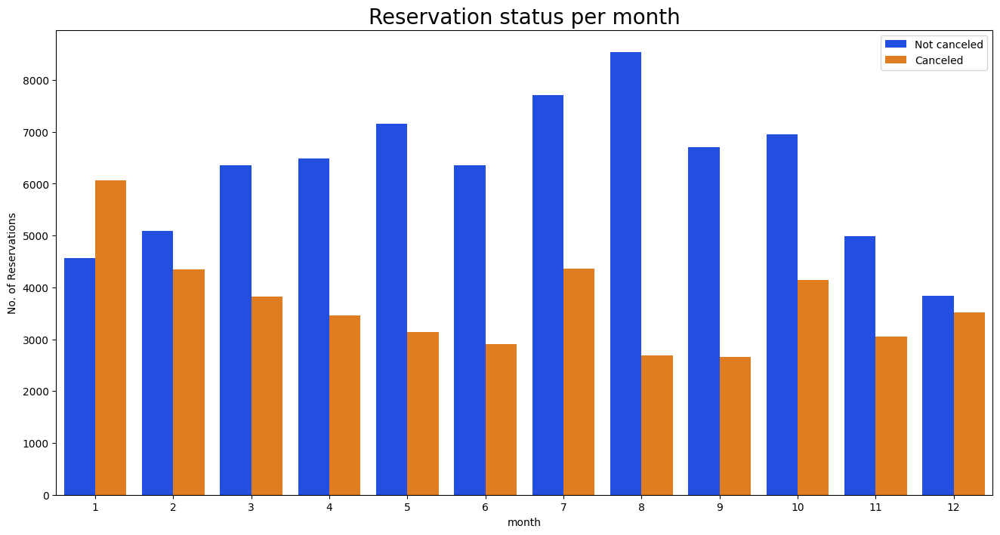
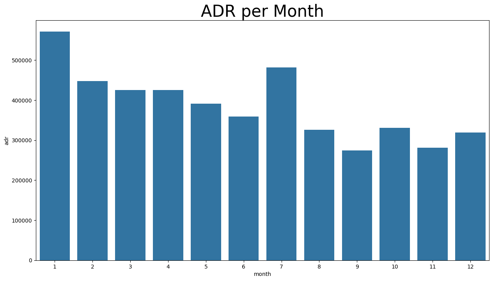
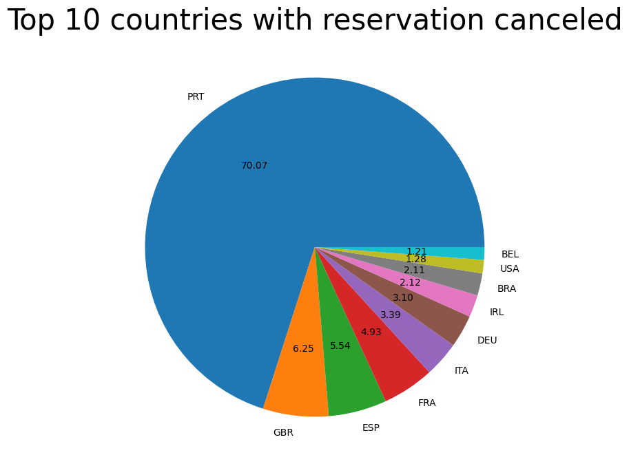
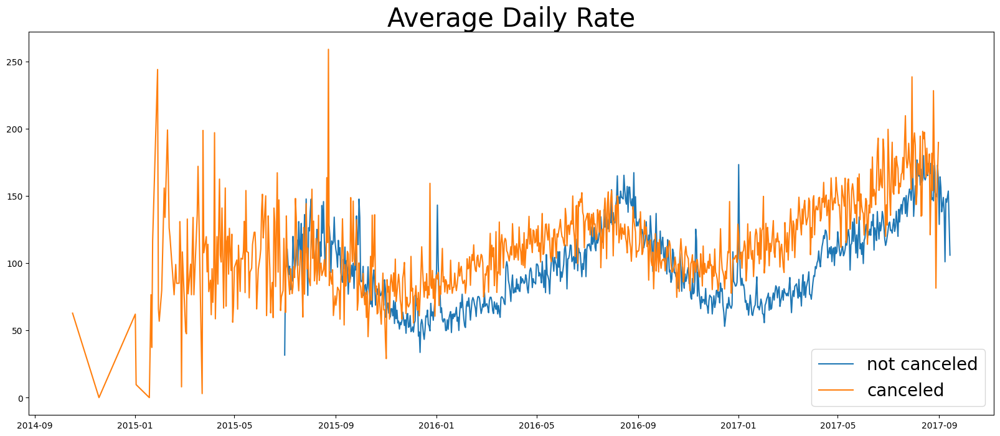
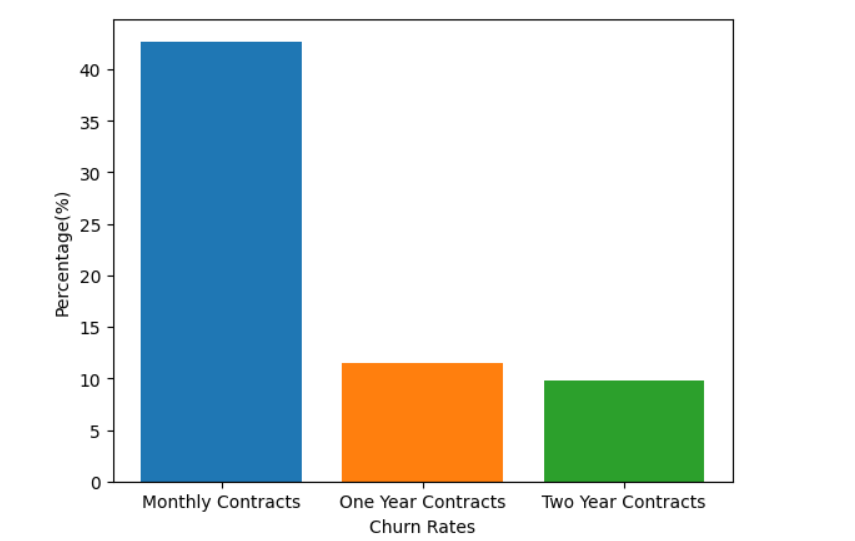

Welcome to my **Data Analytics Portfolio!**  
This repository showcases my projects, skills, and approaches in **data cleaning, analysis, visualization, and business insights** using tools like **Python, SQL, Excel, Power BI, and Tableau**.

---

## 🧠 About Me

Hi! I'm **Gaurav Gyansu**, a data enthusiast passionate about transforming raw data into meaningful insights.  
I enjoy exploring real-world datasets, identifying trends, and telling stories through visuals and data-driven reports.

📍 Location: [Dehradun,Uttarakhand,India,248001]  
📧 Email: [gyansu75@gmail.com]  
🔗 [LinkedIn](www.linkedin.com/in/gaurav-gyansu-66b1121b9)  
🌐 Portfolio Website: []

---

## 🧠 Professional Experience

**DATA SCIENCE INTERN | CODESOFT | APR 2026 - MAY 2026**
[CLICK TO KNOW MORE ABOUT MY WORK AND PROJECTS I MADE DURING MY INTERNSHIP](https://gyansu75.github.io/CODSOFT/)

**OMNI SPORTS LEADER SALES/CRM | DECATHLON SPORTS INDIA | DEC 2023 - MAY 2024**

---

## 🧰 Tools & Technologies

| Category | Tools / Skills |
|-----------|----------------|
| **Programming** | Python (Pandas, NumPy), DSA |
| **Data Visualization** | Power BI, Tableau, Matplotlib, Excel, Seaborn, Pair Plots, Bar Charts, , Confusion Matrix |
| **Databases** | MySQL, PostgreSQL, SQLite |
| **Excel Skills** | Pivot Tables, Dashboards, Lookup Functions |
| **Data Science** | Statistics(Mean, Mode, Median, Standard Deviation), Data Cleaning, Data Modelling, EDA, Data Evaluation and Testing, Reporting |
| **Artificial Intelligience** | Gen AI ( Claude, Gemini, ChatGPT, Perplexity... )|
| **Machine Learning** | Scikit-learn, Logistic Regression, Random Forest Algorithm, Accuracy Score, 80% Train and 20% Test Method |

---

## 📁 Projects

### 1. [Hotel Booking and Cancellations Analysis](https://gyansu75.github.io/Hotel_booking_analysis/)
**Tools:** Python, Pandas, Seaborne, NumPy, Matplotlib   
- Analyzed monthly and regional sales data to track KPIs.  
- Built an interactive Power BI dashboard showing sales trends, revenue, and top products.  
- [View Project Folder →](https://github.com/gyansu75/Hotel_booking_analysis)

---

### 2. 💬 [TELECO Customer Churn Analysis for Scriptguru Digital Solutions Pvt. Ltd](https://gyansu75.github.io/Teleco-Customer-Churn-Dataset-Analysis/)
**Tools:** Python, Pandas, Matplotlib  
- Cleaned telecom customer data and identified churn patterns.  
- Built visualizations to show factors influencing customer retention.  
- [View Project Folder →](https://github.com/gyansu75/Teleco-Customer-Churn-Dataset-Analysis)

---

### 3. 🏦 [Daikibo-Telemetry-Data-Analysis Insights for Deloitte Data Analyst Job Simulation on Forage]()
**Tools:** Python, Pandas, Excel, Tableau 
- Built financial reports and viualisations on Tableau about the Factory down-time analysis.
- Performed Data Cleaning and Modeling on the Dataset and created a CSV file using MS Excel.   
- Updated the Salary Equality Index column in 3 different categories using Python for better understanding the Income Inequalites in the Factories.  
- [View Project Folder →](https://github.com/gyansu75/Daikibo-Telemetry-Data-Analysis)

---

## 📊 Sample Visuals

---

## 📈 Learning & Goals

I’m continuously improving my skills in:
- Advanced SQL queries & joins  
- Machine learning for data-driven predictions  
- Dashboard design and storytelling

---

## 🏁 How to Explore

1. Browse each project folder for datasets, notebooks, and visuals.  
2. Read the project-specific `README.md` files for detailed explanations.  
3. Reach out if you’d like to collaborate or discuss insights!

---

## 🤝 Connect With Me

- 💼 [LinkedIn](www.linkedin.com/in/gaurav-gyansu-66b1121b9)   
- 🌐 [Mail](gyansu75@gmail.com)  

---

> “Without data, you're just another person with an opinion.” — W. Edwards Deming

---

⭐ **If you like my work, consider starring this repo!** ⭐
